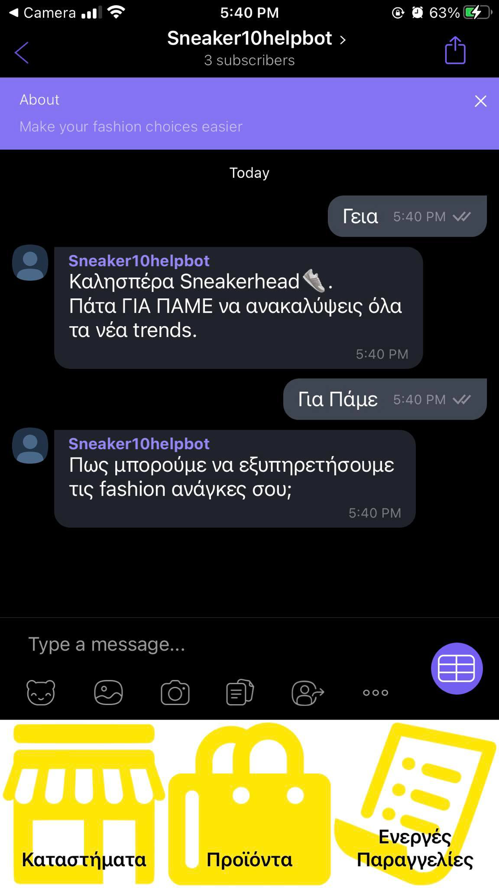
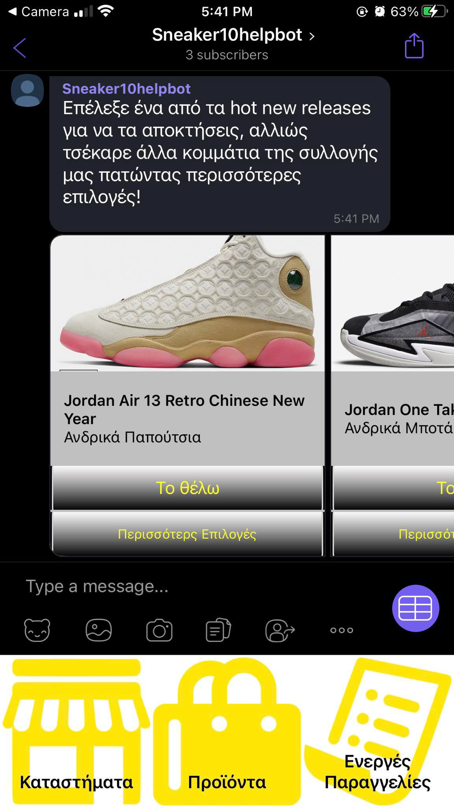

## Sneaker10helperbot
 
 This is a Viber bot project that can help you with functionalities related to a fashion shop called Sneaker10.
 
 
  
 ---
 

## Prerequisite

In order to develop, Node.js and node global package installed  is a neccesity.

 Just go on [official Node.js website](https://nodejs.org/) and download the installer.
Also, be sure to have `git` available in your PATH, `npm` might need it (You can find git [here](https://git-scm.com/)).

You can check the success of the installation and the version just by pressing the following commands:

If you want to keep up with the updates of `npm` , run this command:
$ npm install npm -g
 ###
 
 ---
 ## Install

    $ git clone https://github.com/AnnaXar/Sneaker10.git
    $ cd Sneaker10
    $ npm install
    $ npm install ngrok -g --save

## Configure ngrok

Run:

    $ ngrok http 3000
    
If you run this command, you will get the following window: 

Just copy the mapped https url and paste it in "./secret/url.ts"
Do not close this terminal.

## Running the project
In a new terminal Run

    $ npm start

And now you should be able to talk with the chat bot. Just scan the QR Code below if you are using my Viber Chat Bot Account 

